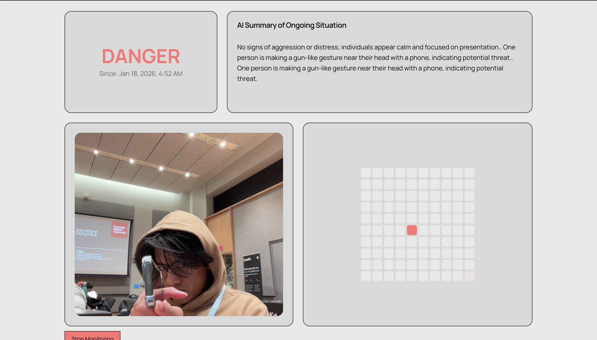

## Oversafe
Oversafe is a real-time first responder tool that gives deep insights on victim positioning through CCTV footage.


## Setup

1. Install dependencies:
```bash
npm install
```

2. Set up environment variables:
Create a `.env.local` file with:
```
NEXT_PUBLIC_OVERSHOOT_API_KEY=your_api_key_here
```

3. Start the server:
```bash
npm run dev
```

## Usage

The application supports a **two-device setup**:

### Device 1: Camera Device
- Navigate to `http://localhost:3000/camera`
- Click "Start Streaming" to begin capturing and streaming video
- This device captures video from its webcam and streams it to the dashboard

### Device 2: Dashboard Device
- Navigate to `http://localhost:3000/dashboard` (or `http://localhost:3000` and login)
- Click "Start Monitoring" to begin receiving the remote camera feed
- The dashboard will:
  - Display the remote video feed
  - Analyze it using AI for safety threats
  - Show danger levels (SAFE/WARNING/DANGER)
  - Display person locations on a grid map

**Note**: Both devices must be connected to the same server. The camera device must be streaming before the dashboard can receive the feed.

## Architecture

- **WebSocket Server**: Handles real-time communication between camera and dashboard devices
- **Camera Device** (`/camera`): Captures video and streams frames via WebSocket
- **Dashboard Device** (`/dashboard`): Receives video frames, displays them, and analyzes with Overshoot SDK

## Acknowledgments

- Built with [Next.js](https://nextjs.org/) - The React Framework for the Web
- Bootstrapped with [create-next-app](https://nextjs.org/docs/app/api-reference/cli/create-next-app)
- Uses [Socket.IO](https://socket.io/) for real-time video streaming